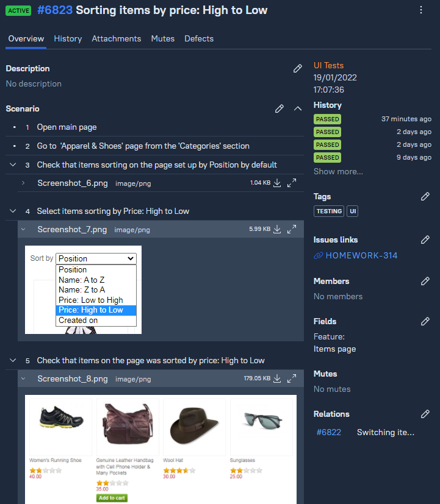
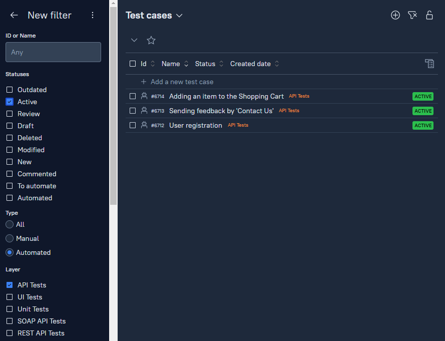
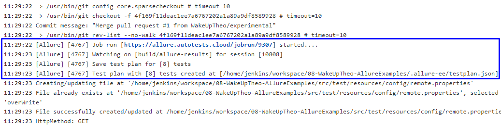
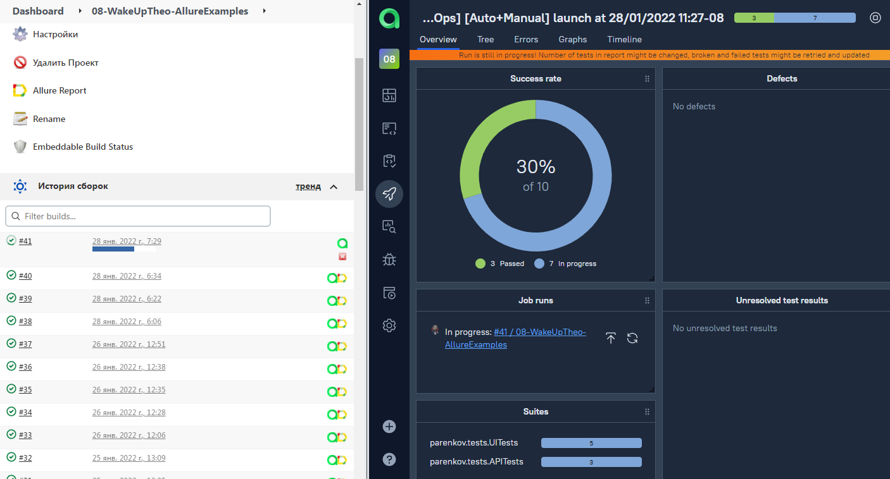
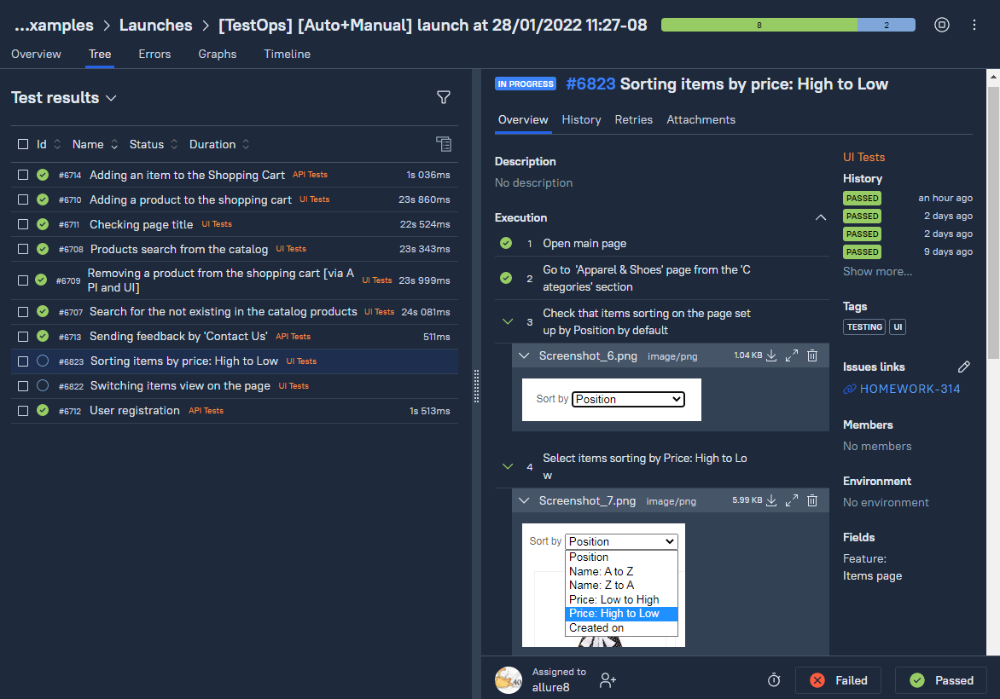
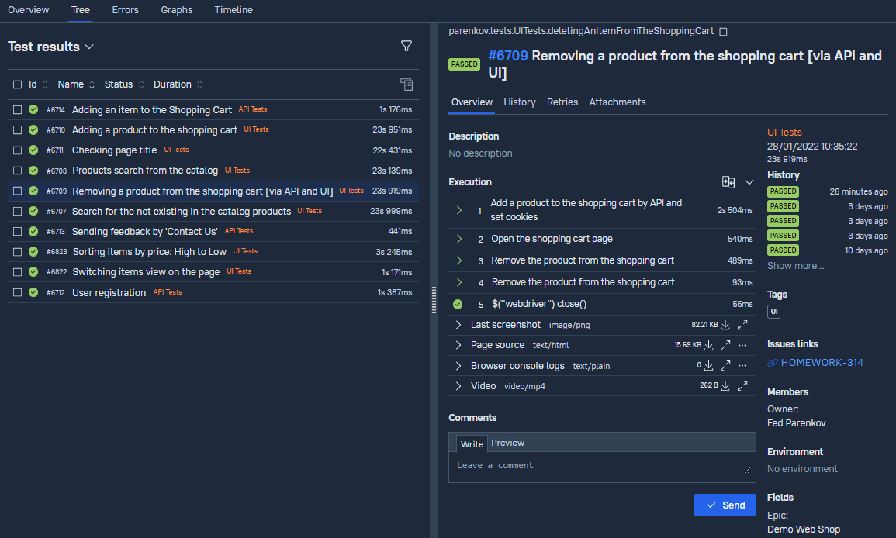
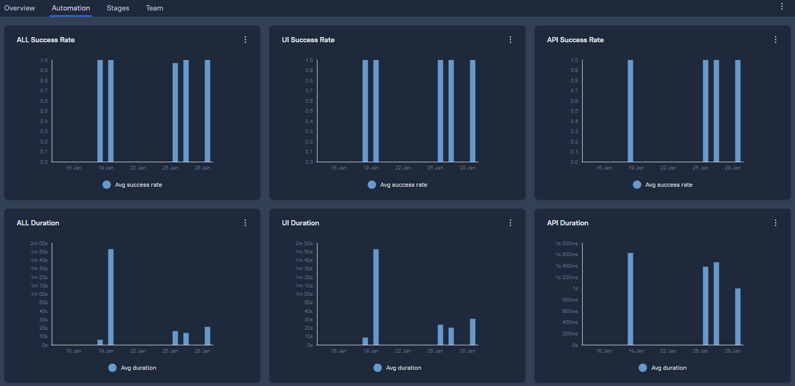
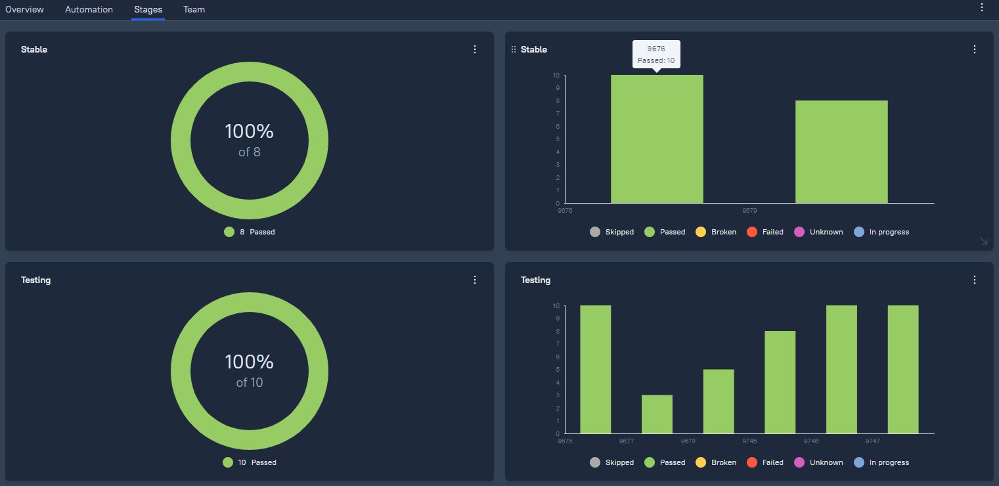
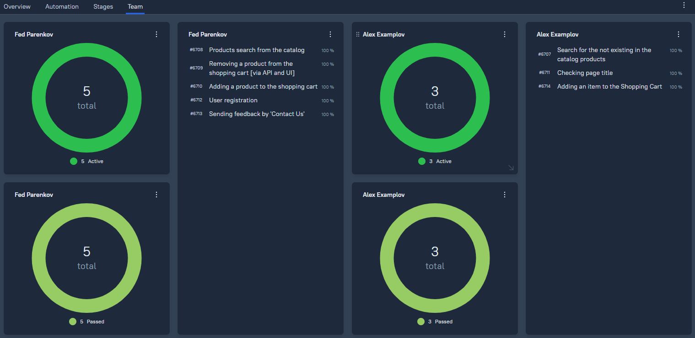
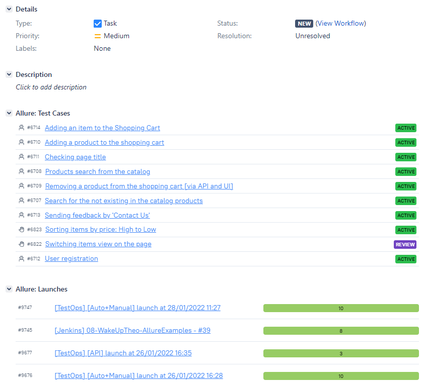

## Пример использования [Allure TestOps](https://docs.qameta.io/allure-testops/)
В данном мини-проекте представлен пример использования Allure TestOps для создания тестовой документации и запуска UI, API автотестов и ручных UI тестов, проверяющих функциональность web-версии сайта **[Tricentis Demo Web Shop](http://demowebshop.tricentis.com/)**. 

### Использованный технологический стек
     
    

### Запуск тестов в CI Jenkins и Allure TestOps
Для запуска автотестов сконфигурирована **[job](https://jenkins.autotests.cloud/job/08-WakeUpTheo-AllureExamples/)** в CI Jenkins с интеграцией Allure TestOps. В TestOps создан **[проект](https://allure.autotests.cloud/project/892/dashboards)** в котором генерируется тестовая документация при запуске job в CI. Также в проект TestOps добавлены ручные тест-кейсы:  

С помощью аннтотаций Allure и настроек проекта TestOps прописана дополнительная информация, например, о создателе автотеста, наименование feature и микросервиса, test layer и др. Благодаря добавленной метаинформации можно фильтровать тесты в TestOps:  

Для запуска тестов из TestOps создается Run с выбранными тестами с привязкой к CI job. При этом в CI в формате json передается информация о тест-плане, т.е. о том, какие тесты и в каком количестве включены в Run:  

Одновременно с запуском тестов в CI в реальном времени отображается информация о процессе выполнения тестов в TestOps:  

Прохождение ручных тест-кейсов, включенных в TestOps Run:  

Результаты по итогам выполнения TestOps Run:  

### Метрики в Allure TestOps
Для отображения метрик создаются различные dashboards.  
**Примеры** 
Успешность и время выполнения тестов:  

Статистика по запускам в разных environments:  

Метрики по членам команды:  

### Интеграция с Jira
С помощью контекстного меню TestOps создана привязка информации о тест-кейсах и результатах запусков с **[задачей](https://jira.autotests.cloud/browse/HOMEWORK-314)** в Jira:  

